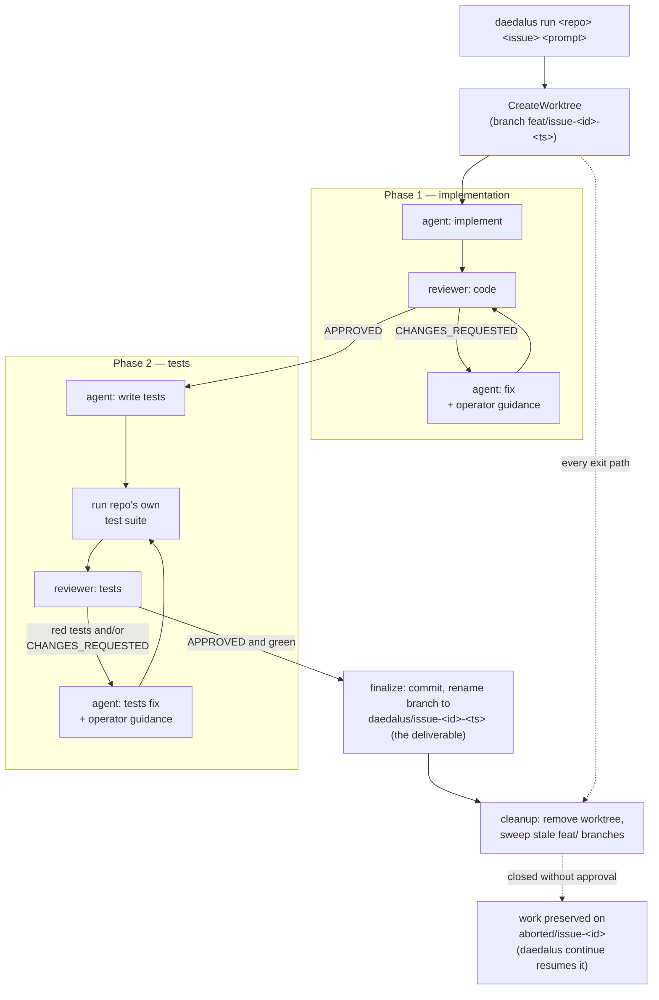

# Daedalus

[](https://github.com/ozzono/daedalus/actions/workflows/ci.yml)
[](https://github.com/ozzono/daedalus/tags)
[](https://go.dev)

A local, sandboxed AI developer agent control plane, written in Go and
orchestrated via [Temporal](https://temporal.io).

Daedalus turns an issue into working, reviewed, tested code. Given a
repository, an issue ID, and a prompt, it spins up an isolated git worktree
and runs two review-gated loops inside it: a jailed agent —
[Claude Code](https://claude.com/claude-code) by default, or
[opencode](https://opencode.ai) — implements the change
while a jailed reviewer approves the code; the agent then writes the test
suite while the reviewer — and the repository's own test suite — approve the
tests. Each loop runs until its reviewer approves. Temporal provides durable
execution: every step is auditable and survives worker restarts, and a run
that dies (crash, cancellation, API quota exhaustion) leaves its work
preserved and resumable.



## Why

Letting an AI agent loose on your working copy is risky. Daedalus never
touches your checkout: all agent work happens in a throwaway worktree under
`~/.daedalus/worktrees/<queue>/issue-<id>`, wrapped in [ai-jail](https://github.com/anthropics/ai-jail)
for filesystem confinement (the worktree is the only writable path; network
access is granted so the agent's CLI can reach its provider). The worktree is
always removed at the end of the run, success or failure — but never at the
cost of the work: a run that closes without approval has its commits
preserved on an `aborted/issue-<id>` branch that `daedalus continue` picks
up.

## Prerequisites

- Go 1.26+
- A Temporal server: `temporal server start-dev` — all defaults match
  (frontend `127.0.0.1:7233`, UI :8233)
- The `ai-jail` CLI on your `PATH`
- The `claude` CLI (invoked by the jail), or `opencode` when
  `agent: opencode` is set in config.yaml

## Usage

1. **Build and install** the CLI:

   ```sh
   go install ./cmd/daedalus
   ```

2. **Start a Temporal server** (first terminal — skip if one is already
   running):

   ```sh
   temporal server start-dev
   ```

3. **Create your config and start a worker** (second terminal):

   ```sh
   daedalus init                  # writes config-example.yaml
   cp config-example.yaml config.yaml   # then edit as needed
   daedalus worker
   ```

   `daedalus worker` runs the worker as a detached daemon: one per task
   queue, logs appending to `/tmp/daedalus/worker-<queue>.log` (pruned to
   the past week), pid in `/tmp/daedalus/worker-<queue>.pid`. Manage it with
   `daedalus worker stop|status|restart`, or `daedalus worker foreground` to
   run it attached to a terminal (the way to debug a worker that will not
   start).

4. **Trigger a pipeline** (third terminal):

   ```sh
   daedalus run /path/to/repo 42 "Add a /health endpoint that returns 200."
   ```

   The third argument is the **task description** — the full issue text the
   implementing agent works from. Daedalus has no issue-tracker integration:
   it never fetches the description from anywhere, so paste or write the
   entire task (context, requirements, acceptance criteria) into that quoted
   string. Use `--` first if the text itself starts with a `-`:

   ```sh
   daedalus run /path/to/repo 42 -- "-c flag parsing must survive --config= in prompts"
   ```

   For long descriptions, pass a file instead — either the argument or the
   file, never both:

   ```sh
   daedalus run -f issue-42.md /path/to/repo 42
   ```

`run` prints the Workflow ID (`daedalus-issue-42`) and Run ID, then blocks
until the pipeline finishes (up to 4 h; the workflow keeps running past
that). On success it prints the preserved branch holding the committed,
approved work, e.g. `daedalus/issue-42-1726320000`. Follow along in the
Temporal UI at http://127.0.0.1:8233, or with `temporal workflow show`.

Prefer fire-and-forget? `daedalus run -d` starts the pipeline and returns
immediately; `daedalus attach <workflow-id>` reconnects later, blocks until
it finishes, and reports the outcome (also works after a run has ended).
`daedalus list` shows the most recent sessions on this task queue —
session id, status, and last interaction time.

### Steering and resuming

- **Steer a running pipeline**: `daedalus guide <workflow-id> "<message>"`
  sends operator guidance that is folded into the agent's *next* fix
  prompt, steering a stuck review loop without restarting the run.
  `daedalus run -a <workflow-id> "<prompt>"` is the same thing with a
  fuller prompt (`-f/--file` works there too).
- **Resume a closed one**: `daedalus continue <workflow-id> "<prompt>"`
  restarts a canceled, failed, or API-exhausted session under a new prompt.
  The aborted attempt's preserved work (its `aborted/<issue>` branch)
  becomes the new run's starting point, and that attempt's last review
  feedback is folded into the opening prompt. An agent run that fails on
  provider quota/rate limits is labeled as such (`agent api exhausted or
  unavailable`) so you can tell "continue later" apart from a code failure.

`daedalus` or `daedalus --help` prints full usage.

## Configuration

All configuration lives in `config.yaml` (override the path with
`-c/--config`); `daedalus init` writes a fully commented
`config-example.yaml` documenting every field and its default:

| Field                 | Default            | Purpose                              |
| --------------------- | ------------------ | ------------------------------------ |
| `agent`               | `claude`           | Jailed agent CLI: `claude` or `opencode` |
| `temporal.host`       | `127.0.0.1:7233`   | Temporal frontend address            |
| `temporal.ui_port`    | `8233`             | Temporal UI port (shown at startup)  |
| `temporal.task_queue` | `daedalus`         | Routing key; distinct projects/flows on one Temporal use distinct queues |
| `anthropic.url`       | `""` (inherit env) | Anthropic API base URL — set only to override |
| `anthropic.key`       | `""` (optional)    | API key for the jailed agent; if unset, the agent authenticates via the worker's inherited environment or its own login |
| `anthropic.model`     | `""` (agent default) | Model for the jailed agent         |
| `openai.url/key/model`| `""` (inherit env) | Optional OpenAI settings, exported as `OPENAI_*` into the agent's environment for tooling it runs; not consumed by daedalus itself |

Provider settings that are set are exported into the worker's environment
at startup and injected into the jailed agent's process environment; unset
ones are simply not exported, so the agent inherits whatever the worker's
environment provides. The API key deliberately never appears in CLI
arguments, workflow inputs, or Temporal history — only in `config.yaml`,
the worker's environment, and the jailed process's environment. Keep
`config.yaml` out of version control (it is gitignored; the example file is
the committed template).

The Temporal task queue comes from `temporal.task_queue` (default `daedalus`);
worktrees live under `~/.daedalus/worktrees/<queue>/issue-<id>`. Re-running
`daedalus run` for an issue whose previous pipeline succeeded starts a new run
(duplicates are allowed) — the previous run's preserved branch stays.

## Pipeline details

- **Two review-gated phases**: the implementation phase loops
  agent ↔ reviewer until the reviewer approves; the test phase loops
  agent ↔ (test suite + reviewer) until the reviewer approves *and* the
  suite passes. Review rounds are intentionally **unbounded** — the workflow
  ends only on approval, with every round durable and auditable.
- **Reviewer protocol**: the reviewer sees the diff of the worktree (plus
  the latest test output in phase 2) and must end its response with a final
  line `APPROVED` or `CHANGES_REQUESTED`. Anything else — including a
  malformed response — counts as changes requested, with the full output fed
  back to the implementing agent.
- **The repo's own test suite**, whatever it is: the test command is
  resolved per repository — a `tests:` declaration in `.daedalus.yaml` wins;
  otherwise marker files are detected (`go.mod` → `go test ./...`,
  `package.json` with a test script → `npm test`, pytest configs →
  `pytest -q`, Makefile `test-ui`/`test-api` targets → `make …`); for
  repositories none of that recognizes, a short jailed agent run discovers
  the command. The resolved command is recorded in the workflow history.
- **Branch lifecycle**: `feat/issue-<id>-<unix>` is the in-flight branch
  (always cleaned up, along with stale `feat/` branches from crashed runs);
  `daedalus/issue-<id>-<unix>` is the committed, approved deliverable;
  `aborted/issue-<id>` carries a run that closed without approval, replaced
  by each newer abort and consumed by `daedalus continue`.
- **Operator guidance**: `daedalus guide` (or `run -a`) messages arrive as a
  Temporal signal and are prefixed onto the agent's next fix prompt,
  marked as direct operator instructions taking precedence over earlier
  plan assumptions.
- **Workflows are selectable**: `daedalus run -w feature-dev ...` (the
  default) picks from a name registry; adding another flow later is one
  registry entry.
- **Activities** run with a 15-minute start-to-close timeout and no retries
  (`MaximumAttempts: 1`) — a failed activity fails the run rather than
  re-running an agent that already mutated the worktree. Cancellation kills
  the whole jailed process group, not just the jail wrapper. Agent/reviewer
  failures that look like provider quota or rate limits are labeled as API
  exhaustion so the halt is recognizable as `continue`-able.
- **Prompt transport**: prompts travel to the jailed agent via stdin, not
  argv — no `ps` visibility, no per-argument size limit on review prompts
  that embed the full diff. Verdicts are parsed from stdout only, so
  trailing stderr noise cannot flip an `APPROVED`.
- **History diet**: the agent's visible text and chain of thought come back
  in the activity result tail-bounded to 16 KiB each (visible per round in
  the Temporal UI), test logs likewise; the worker log keeps the full
  untruncated stream.
- **Multiple projects / flows on one Temporal**: each deployment sets its own
  `temporal.task_queue`; workflow IDs (`<queue>-issue-<id>`) and worktree
  paths (`~/.daedalus/worktrees/<queue>/issue-<id>`) are scoped by queue, so
  same-numbered issues in different projects never collide.
- **Cleanup**: a deferred activity runs on every exit path — including
  cancellation (via a disconnected context) and agent, reviewer, or test
  failures — to remove the worktree (`--force`), prune git's worktree
  metadata, sweep stale `feat/issue-<id>-*` branches left by crashed runs,
  and preserve unapproved work on `aborted/` first. Preserved `daedalus/`
  branches are never touched; leftover worktree state is healed on the next
  run of the same issue.

## Development

Run the test suite:

```sh
go test ./...
```

Tests are hermetic: subprocess-backed activities are exercised against stub
`git`/`go`/`ai-jail` executables installed on a temporary `PATH`, and the
workflow is tested in Temporal's in-process `TestWorkflowEnvironment` with
mocked activities — no server, network, or API key needed.

Releases are git tags. CI runs the suite on every PR and master push — a PR
must carry exactly one release label (`patch`, `minor`, or `major`) before it
can merge. After a green master push, CI tags the merged code with the next
version, using that PR's label to pick the bump level (`patch` for pushes
that are not PR merges) and publishes a GitHub Release for the tag with
auto-generated notes — there is no version file and no other release
tooling. `daedalus --version` reports the tag-stamped version of a
`make build` binary; a plain `go build`/`go install` binary reports
`(devel)`.
