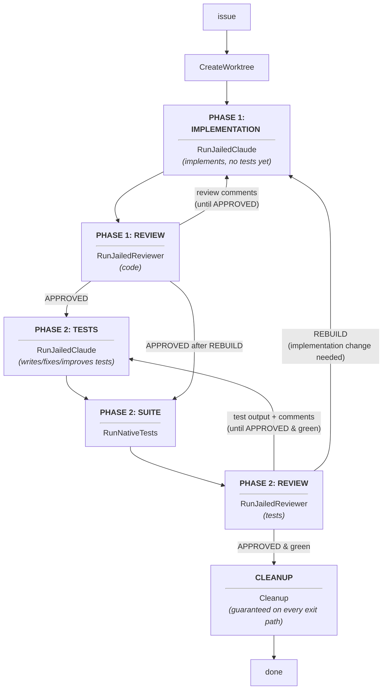

# Daedalus

[](https://github.com/ozzono/daedalus/actions/workflows/ci.yml)
[](https://github.com/ozzono/daedalus/tags)
[](https://go.dev)

A local, sandboxed AI developer agent control plane, written in Go and
orchestrated via [Temporal](https://temporal.io).

Daedalus turns an issue into working, reviewed, tested code. Given a
repository, an issue ID, and a prompt, it spins up an isolated git worktree
and runs two review-gated loops inside it: a jailed agent —
[Claude Code](https://claude.com/claude-code) by default,
[opencode](https://opencode.ai), [Amp](https://ampcode.com) (deprecated —
see below), [pi](https://pi.dev), [aider](https://aider.chat) (deprecated —
see below), or [codex](https://developers.openai.com/codex/) —
implements the change
while a jailed reviewer approves the code; the agent then writes the test
suite while the reviewer — and the repository's own test suite — approve the
tests. Each loop runs until its reviewer approves. When the test reviewer
finds the work needs an implementation change rather than a test change —
on its own finding or on the tester's report, relayed to it — it verdicts
REBUILD: the finding goes back to the implementation loop with a tight,
finding-only prompt, and the test loop (both sessions' context intact)
resumes once the code reviewer approves again. Temporal provides durable
execution: every step is auditable and survives worker restarts, and a run
that dies (crash, cancellation) or parks itself — provider quota exhausted
past its hourly heartbeats, or a reviewer halt on an impossible task —
leaves its work preserved and resumable.


```mermaid
flowchart TD
    PROMPT["issue"] --> CREATE["CreateWorktree"]
    CREATE --> P1_IMPL

    %% Phase 1 Nodes
    P1_IMPL["<b> PHASE 1: IMPLEMENTATION </b><hr/>RunJailedClaude<br/><i>(implements, no tests yet)</i>"]
    P1_REV["<b> PHASE 1: REVIEW </b><hr/>RunJailedReviewer<br/><i>(code)</i>"]

    P1_IMPL --> P1_REV
    P1_REV -- "review comments<br/>(until APPROVED)" --> P1_IMPL

    P1_REV -- "APPROVED" --> P2_IMPL

    %% Phase 2 Nodes
    P2_IMPL["<b> PHASE 2: TESTS </b><hr/>RunJailedClaude<br/><i>(writes/fixes/improves tests)</i>"]
    P2_TEST["<b> PHASE 2: SUITE </b><hr/>RunNativeTests"]
    P2_REV["<b> PHASE 2: REVIEW </b><hr/>RunJailedReviewer<br/><i>(tests)</i>"]

    P2_IMPL --> P2_TEST
    P2_TEST --> P2_REV
    P2_REV -- "test output + comments<br/>(until APPROVED & green)" --> P2_IMPL

    %% REBUILD: the test reviewer can send an implementation-level finding
    %% back through the dev cycle. After the code reviewer approves the
    %% rebuild, flow resumes at the suite re-run — no fresh test-agent
    %% round (the rebuild never touches test files); both sessions'
    %% context stays intact.
    P2_REV -- "REBUILD<br/>(implementation change needed)" --> P1_IMPL
    P1_REV -- "APPROVED after REBUILD" --> P2_TEST

    P2_REV -- "APPROVED & green" --> CLEAN

    %% Final Nodes
    CLEAN["<b> CLEANUP </b><hr/>Cleanup<br/><i>(guaranteed on every exit path)</i>"]
    DONE["done"]

    CLEAN --> DONE
```

## Why

Letting an AI agent loose on your working copy is risky. Daedalus never
touches your checkout: all agent work happens in a throwaway worktree under
`~/.daedalus/worktrees/<queue>/issue-<id>`, wrapped in [ai-jail](https://github.com/anthropics/ai-jail)
for filesystem confinement (the worktree is the only writable path; network
access is granted so the agent's CLI can reach its provider). The worktree is
always removed at the end of the run, success or failure — but never at the
cost of the work: a run that closes without approval has its commits
preserved on an `aborted/issue-<id>` branch that `daedalus continue` picks
up.

## Prerequisites

- Go 1.26+
- A Temporal server: `temporal server start-dev` — all defaults match
  (frontend `127.0.0.1:7233`, UI :8233)
- The `temporal` CLI on your `PATH`, and the run-visibility search
  attributes registered once per namespace via `make custom-columns` —
  before starting an upgraded worker: with the attributes missing, the
  server rejects every new run's first status upsert and the run wedges
  (old, already-running runs are unaffected)
- The `ai-jail` CLI on your `PATH`
- One supported jailed-agent CLI:
  - `claude` (the default, invoked by the jail)
  - `opencode` when `agent: opencode` is set in config.yaml — the jail
    bridges opencode's state dir (`~/.local/share/opencode`, or
    `$XDG_DATA_HOME/opencode` when that var is set, which is passed
    through) read-write, so jailed rounds share the host's session
    database and auth: rounds chain conversations for resume, and host
    login state reaches jailed rounds (the same accepted trade pi and
    codex make). opencode reads no `OPENAI_*` var natively, so an
    `openai:`-section round is bridged per invocation through a staged
    round-scoped config file exposed via `OPENCODE_CONFIG` (a custom
    provider entry — the key rides a `{env:OPENAI_API_KEY}` template and
    never lands on disk; see `stageOpencodeProvider`), while an
    `anthropic:`-section round has no opencode channel — daedalus stages
    nothing and the round resolves its own config inside the jail: a
    repo-committed opencode.json is honored, the host's global one is not
    (the jail bridges only the state dir, no opencode config dir)
  - `amp` when `agent: amp` is — authenticates via `AMP_API_KEY` in the
    worker's environment, which daedalus passes into the jail when set;
    amp's own host login does not reach the jail. **Amp support is
    deprecated:** it keeps working exactly as it does today, but it is no
    longer changed or maintained — no new flags, fixes, or probes.
  - `pi` when `agent: pi` is — authenticates via the provider env vars
    (`ANTHROPIC_API_KEY`, `OPENAI_API_KEY`, ...) that daedalus already
    exports; the jail bridges pi's host `~/.pi/agent/auth.json` read-write
    and that login takes priority over the env vars, so a stale host login
    wins — keep it clean or aligned. pi-served implementing rounds also
    carry an edit-discipline guardrail in their prompt (read before edit,
    read again after a failed edit — cheap insurance for small self-hosted
    models); a resumed pi session whose transcript embeds tool-call JSON as
    assistant text is not resumed (the pattern is self-reinforcing poison),
    and one ending in repeated failed `edit` calls gets its next round
    steered toward read-then-retry. Flagship agents' prompts and resume
    paths are byte-for-byte untouched.
  - `aider` when `agent: aider` is — authenticates via the same provider
    env vars; the repo's `.env` is masked to empty inside the jail, so it
    cannot override the exported env. **Aider support is deprecated:** it
    keeps working exactly as it does today, but it accepts no new flags,
    fixes, or probes — its gaps are accepted limitations: no
    id-addressable resume (rounds always start fresh), openai-only model
    wiring (the anthropic half awaits a probe of the installed litellm's
    anthropic provider), and a uv-tools-only install layout.
  - `codex` when `agent: codex` is — authenticates via its host login
    state (`~/.codex`, or `$CODEX_HOME` when that var is set — the jail
    bridges the directory read-write and passes the var through) plus the
    provider env vars daedalus exports. codex reads
    no `OPENAI_*` var natively and speaks only OpenAI wire formats, so an
    `openai:`-section round is bridged per invocation through codex's own
    `-c` config overrides (a staged provider entry — the key value never
    lands in argv or on disk; see `stageCodexProvider`), while an
    `anthropic:`-section round has no codex channel at all
- The repo's `.claude/settings.json` / `.claude/settings.local.json` are
  masked to empty inside the jail: a committed settings file's `env` block
  would otherwise apply over the exported env inside the jail (a stale
  `ANTHROPIC_AUTH_TOKEN` there once authenticated every round as a dead
  credential). Outside the jail — repro activities, anything you run
  yourself — repo settings files are honored as usual
- Context-window tuning support varies by CLI (probed against the
  installed CLIs, 2026-09-25):
  - `aider` — fully wired: daedalus stages a model-metadata file
    (`max_input_tokens` / `max_output_tokens`, 64k/8k defaults) for
    configured openai-style models automatically; `anthropic.context_tokens`
    overrides the input side when set
  - `claude` — daedalus exports `CLAUDE_CODE_MAX_CONTEXT_TOKENS` when
    `anthropic.context_tokens` is set in config.yaml (a settings-file
    `env` block would not reach jailed rounds — masked, above; the `[1m]`
    model-name suffix for the 1M window is expressible today via the
    configured `model`)
  - `opencode` — openai-served rounds stage `limit.context` on the staged
    provider's model entry (selected with `-m`); without the openai
    section, the window is overridden per model in opencode.json
    (`provider.<id>.models.<model>.limit`), which a jailed round honors
    from a repo-committed file (the host's global config is not mounted)
  - `pi`, `amp` — unprobed (neither binary was available to probe)
  - `codex` — no wired lever (unprobed; a `model_providers` entry carries
    no request params)

## Usage

The full CLI surface is answerable from the binary itself: `daedalus -h`
lists every command with a one-line flag hint, `daedalus <command>
--help` prints that command's detail, and `daedalus worker <action>
--help` prints a sub-action's flag rules (which flags it accepts, which
it rejects). The tables below carry the same surface — this section and
the help text are kept in agreement.

| Command | Arguments | Flags | Purpose |
|---|---|---|---|
| `run` | `<repo-path> <issue-id> "<prompt>"` | `-w -d -p -cli -folder -dep -f -a` | Start an implementation pipeline for an issue |
| `run -a <workflow-id>` | `<workflow-id> ["<prompt>"]` | `-f` | Append a prompt to an already-running pipeline (same as `guide`) |
| `continue` | `<workflow-id> "<prompt>"` | `-d` | Resume a closed, failed, or parked session |
| `guide` | `<workflow-id> "<message>"` | — | Send operator instructions to a running pipeline |
| `attach` | `<workflow-id>` | — | Reconnect to an in-flight or completed pipeline |
| `list` | `[max]` | — | Display past and current sessions on the task queue |
| `log` | `<workflow-id>` | `--status -cot -cot-n` | Show a session's captured task log (raw, status brief, or chain-of-thought) |
| `wipe` | `<workflow-id>` | `--yes` | Erase a session's disk work entirely (worktree, branches, logs) |
| `worker start` | — | `-c -t` | Run the worker daemon detached (the default worker action) |
| `worker stop` | — | `-c` | Drain the daemon gracefully (SIGTERM) |
| `worker status` | — | — | List every worker on record (plus live strays) with live probes; the stuck-work recapture point |
| `worker restart` | — | `-c -t` | Stop + start this config's worker with the config re-read from disk |
| `worker restart <worker>` | `<worker>` | — | Restart one worker from its recorded config, from any directory |
| `worker restart all` | — | `--all` | Restart every worker on record, each from its own record |
| `worker foreground` | — | `-c -t` | Run the worker attached to this terminal |
| `worker wakeup` | `<workflow-id>` | `-c` | Interrupt a RUNNING session's quota heartbeat so the round resumes |
| `init` | `[prompt] [slim]` | — | Generate a fully commented `config-example.yaml` |
| `config` | — | — | Print the active configuration (resolved path + every field) |
| `report` | — | `-q --all --json --table` | Summarize AI provider usage (cost, tokens, time) and worker slots |
| `version` | — | — | Print the version and exit |
| `completion` | `bash\|zsh` | — | Print the tab-completion script (eval into your shell rc) |

Global flags: `-c/--config <path>`, `-v/--version`, `-h/--help`. `-c` is
accepted by every command except `log` and the record-driven worker
commands (`worker status`, `worker restart <worker>`, `worker restart
all`), which act from the recorded per-worker configs alone.

Flag reference:

| Flag | Accepted by | Meaning |
|---|---|---|
| `-w, --workflow <name>` | `run` (fresh runs) | Flow to run: `feature-dev` (default), `dev-only`, `slim`, `investigate`, `test-only`, `refactor`, `bug-fix`. Parsed but without effect on any other command — including `run -a`, where the pipeline keeps the flow it started with |
| `-d, --detach` | `run`, `continue` | Start the pipeline and return immediately; `daedalus attach` reconnects |
| `-p, --prefix <prefix>` | fresh `run` | Name the preserved branch `<prefix>/issue-<id>-<timestamp>`, overriding the config's `branch_prefix` |
| `-cli, --cli <agent>` | fresh `run` | Jailed agent for this run: `claude`, `opencode`, `amp`, `pi`, `aider` (deprecated), `codex` |
| `-folder, --folder <path>` | fresh `run` (repeatable) | Grant the run read-write access to a host folder, mounted at `.daedalus-folders/<basename>` |
| `-dep, --depends <workflow-id>` | fresh `run` | Chain the run behind another; it starts from the dependency's preserved branch once that finishes approved |
| `-f, --file <path>` | `run` (fresh and `-a`) | Read the task description from a file (glob-expandable); replaces the `"<prompt>"` argument |
| `-a, --append <id>` | `run` | Append mode: fold the prompt into an already-running pipeline's next fix round |
| `--status` | `log` | Print a maintainer-facing status brief instead of the raw log |
| `-cot` | `log` | Print the run's chain-of-thought logs from Temporal history |
| `-cot-n <N>` | `log -cot` | Tail the CoT view to the last N completed rounds (whole sections only) |
| `-t, --type dev\|test` | `worker start`, bare `worker restart`, `worker foreground` | Which pollers the daemon starts (`dev` or `test`; omit for both). Rejected by `run`, `worker status`, and the record-driven restarts; parsed but without effect on any other command |
| `--all` | `worker restart`, `report` | Restart every worker on record (same as the `all` argument) / scope the usage slices to every queue on record |
| `--yes` | `wipe` | Skip the interactive confirmation (scripted use) |
| `-q, --queue <queue>` | `report` | Scope the usage slices to one explicit queue instead of the resolved one |
| `--json` / `--table` | `report` | JSON vs table output (table is the default; `--table` is accepted for explicitness) |

1. **Install** the CLI:

   ```sh
   go install github.com/ozzono/daedalus/cmd/daedalus@latest
   ```

2. **Start a Temporal server** (first terminal — skip if one is already
   running):

   ```sh
   temporal server start-dev
   ```

3. **Create your config and start a worker** (second terminal):

   ```sh
   daedalus init                  # writes config-example.yaml
   mkdir -p ~/.config/daedalus && cp config-example.yaml ~/.config/daedalus/config.yaml   # then edit as needed
   daedalus worker
   ```

   A config in `~/.config/daedalus/config.yaml` is found from any
   directory, so `worker`, `run`, and the other commands work wherever you
   invoke them (`./config.yaml` in the working directory wins when present,
   then `./.daedalus/config.yaml` — the repo-local config of the repo your
   shell sits in). `daedalus run <repo-path>` additionally prefers the
   target repo's `.daedalus/config.yaml` over all of the above, so running
   against another repo configures the run for that repo, not the shell's
   cwd: that file replaces the default config outright for the run — no
   field merging — while an explicit `-c` still wins over it.

   `daedalus worker` runs the worker as a detached daemon: one per task
   queue, logs appending to `/tmp/daedalus/worker-<queue>.log` (pruned to
   the past week), pid in `/tmp/daedalus/worker-<queue>.pid`. Manage it with
   `daedalus worker stop|status|restart`, or `daedalus worker foreground` to
   run it attached to a terminal (the way to debug a worker that will not
   start). Each worker records the config it was started with (in
   `/tmp/daedalus/worker-<queue>.conf`), so `restart` reuses the recorded
   settings wherever it's invoked, as long as some config resolves to name
   the queue (pass `-c` or keep a user-level config) — stop then
   `start -c <new>` to move a worker to a different config.
   `daedalus worker restart all` restarts every worker on record, each
   with its own config, in one call — records alone, no config needed
   (an explicit `-c` is rejected there; it would have no effect).
   `daedalus worker status` lists every worker on record — plus any live
   stray running without one, shown as "(no config record)" — queue,
   running pid, a live provider API probe, the repo path each worker's
   queue is currently executing ("idle" when none), config record, and log
   path. Status is also the recapture point for stuck work: a running
   workflow whose outstanding activity attempt is held by a worker
   identity with no live poller (a worker that died mid-round) is
   recovered automatically — the stuck attempt is failed so the workflow
   reschedules it, and a worker is restarted (or started from the queue's
   most recent config record) only when the attempt's queue has no live
   poller left. Each action prints a `[DAEDALUS-ALERT]` line to the
   status output and the worker log. With nothing stuck, status is a
   read-only no-op.

4. **Trigger a pipeline** (third terminal):

   ```sh
   daedalus run /path/to/repo 42 "Add a /health endpoint that returns 200."
   ```

   The third argument is the **task description** — the full issue text the
   implementing agent works from. Daedalus has no issue-tracker integration:
   it never fetches the description from anywhere, so paste or write the
   entire task (context, requirements, acceptance criteria) into that quoted
   string. Use `--` first if the text itself starts with a `-`:

   ```sh
   daedalus run /path/to/repo 42 -- "-c flag parsing must survive --config= in prompts"
   ```

   For long descriptions, pass a file instead — either the argument or the
   file, never both:

   ```sh
   daedalus run -f issue-42.md /path/to/repo 42
   ```

   The path may also be a glob (`notes/*.md`, `/path/to/specs/*`): every
   matching file is read in lexical order and joined into the prompt. A glob
   whose *directory* part carries metachars (`*?[\`) is rejected, because
   that directory is granted to the run read-write (below) and is taken
   literally, never globbed.

   `-folder/--folder <path>` (repeatable) grants the run read-write access
   to a host folder: each is mounted into the jailed rounds' sandbox at
   `.daedalus-folders/<basename>` and named in the agent's opening prompt,
   so the run can do bookkeeping outside the repo — update a shared
   done-index, retire its own task file. Passing `-f` grants the task file's
   containing folder automatically, so the run above can remove
   `issue-42.md` itself. Grants are fresh-run only (rejected in append
   mode), validated at submit, and are the same accepted operator trade as
   the bug-filing mirror: a read-write window onto a host path you chose.

   ```sh
   daedalus run -folder ~/Projects/tasks/daedalus /path/to/repo 42 -f issue-42.md
   ```

   `-cli/--cli <agent>` overrides the config's jailed agent (`claude`,
   `opencode`, `amp`, `pi`, `aider`, `codex`) for this run — the selection
   travels
   with the run, so
   it applies on whichever worker serves the task queue:

   ```sh
   daedalus run -cli amp /path/to/repo 42 "Add a /health endpoint."
   ```

`run` prints the Workflow ID (`daedalus-42`) and Run ID, then blocks
until the pipeline finishes (up to 12 h; the workflow keeps running past
that). On success it prints the preserved branch holding the committed,
approved work, e.g. `daedalus/issue-42-1726320000`; a parked run prints a
`daedalus continue` resume hint instead. Follow along in the
Temporal UI at http://127.0.0.1:8233, or with `temporal workflow show`.

Prefer fire-and-forget? `daedalus run -d` starts the pipeline and returns
immediately; `daedalus attach <workflow-id>` reconnects later, blocks until
it finishes, and reports the outcome (also works after a run has ended).
`daedalus list` shows the most recent sessions on this task queue —
session id, status, and last interaction time.

### Steering and resuming

- **Steer a running pipeline**: `daedalus guide <workflow-id> "<message>"`
  sends operator guidance that is folded into the agent's *next* fix
  prompt, steering a stuck review loop without restarting the run.
  `daedalus run -a <workflow-id> "<prompt>"` is the same thing with a
  fuller prompt (`-f/--file` works there too).
- **Resume a closed one**: `daedalus continue <workflow-id> "<prompt>"`
  restarts a canceled, failed, or parked session under a new prompt.
  The aborted attempt's preserved work (its `aborted/<issue>` branch)
  becomes the new run's starting point, and that attempt's last review
  feedback is folded into the opening prompt. A run that exhausts the
  provider quota first heartbeats — sleeping an hour and retrying the same
  round, up to five times — and then parks itself: it completes with a `run
  parked awaiting maintainer restart` result (the reason visible in the
  workflow history, and the run shows green in the orchestrator — a park
  is a designed outcome, not a failure) so you can tell
  "continue later" apart from a code failure. A reviewer that judges the
  task impossible ends with NEEDS_MAINTAINER and parks the run the same
  way, with its comments carried in the result.
- **Wake a sleeping one**: `daedalus worker wakeup <workflow-id>` ends a
  RUNNING session's quota-heartbeat sleep immediately, so the round retries
  right away instead of at the top of the hour — the lever for when you have
  verified the provider recovered but the run is still waiting out its
  hourly retry. It takes no prompt (that is `guide`/`continue`); the run
  keeps its id and worktree. Closed sessions still resume with `continue`.

`daedalus` or `daedalus --help` prints full usage.

## Configuration

All configuration lives in `config.yaml`, read from the working directory
when one is there, then from `.daedalus/config.yaml` in the working
directory (a repo's own config), otherwise from
`~/.config/daedalus/config.yaml` (override the path with `-c/--config`).
Keeping the config in `~/.config/daedalus/` makes every command — `worker`,
`run`, `list`, … — work from any directory; a repo carrying
`.daedalus/config.yaml` gets the same uniform treatment for daedalus work
invoked from inside it. `daedalus init` writes a fully commented
`config-example.yaml` documenting every field and its default:

| Field                 | Default            | Purpose                              |
| --------------------- | ------------------ | ------------------------------------ |
| `agent`               | `claude`           | Jailed agent CLI: `claude`, `opencode`, `amp` (deprecated, unmaintained), `pi`, `aider` (deprecated), or `codex` (`run -cli/--cli` overrides per run). claude, pi, opencode, and codex chain conversations (`--resume`/`--session`/`run -s`/`exec resume`); amp and aider start each round fresh |
| `branch_prefix`       | `daedalus`         | Prefix for preserved branches (`<prefix>/issue-<id>-<ts>`); `run -p/--prefix` overrides per run |
| `authorship`          | `false`            | When true, daedalus's own commits (the approved deliverable and the aborted-work snapshot) are authored "daedalus `<daedalus@local>`"; false leaves them to the worker's git config |
| `temporal.host`       | `127.0.0.1:7233`   | Temporal frontend address            |
| `temporal.ui_port`    | `8233`             | Temporal UI port (shown at startup)  |
| `temporal.task_queue` | `daedalus`         | Routing key; distinct projects/flows on one Temporal use distinct queues |
| `anthropic.url`       | `""` (inherit env) | Anthropic API base URL — set only to override |
| `anthropic.key`       | `""` (optional)    | API key for the jailed agent; if unset, the agent authenticates via the worker's inherited environment or its own login |
| `anthropic.model`     | `""` (agent default) | Model for the jailed agent         |
| `openai.url/key/model`| `""` (inherit env) | Optional OpenAI settings, exported as `OPENAI_*` into the agent's environment for tooling it runs; not consumed by daedalus itself — except pi, whose openai rounds are staged into `~/.pi/agent/models.json` per round (pi reads the key env var but no base-URL env var), codex, whose rounds consume the section via per-invocation `-c` overrides (codex reads no `OPENAI_*` var natively), and opencode, whose rounds consume it via a staged round-scoped config file exposed through `OPENCODE_CONFIG` (opencode has no provider env channel at all) |
| `slim.enabled/parser_model` | `enabled: false` | Slim mode for small self-hosted models (aider/pi): one jailed-agent round at a time (no two provider requests in flight), aider's weak/editor models pinned to `AIDER_MODEL` under `DAEDALUS_SLIM`, and a defaulted `-w` rerouted to the slim flow. With `parser_model` also set (and the openai section's url configured — the relay resolves against it and never starts without it), the worker starts a loopback tool-call relay (`internal/toolrelay`) that lifts text-encoded tool calls — fenced JSON in the message content, which pi executes only in its native `tool_calls` form — into a synthetic native stream, with the parser model normalizing the arguments via ollama structured output against the tool's own schema; that schema conformance holds on ollama and other format-honoring parser upstreams, while an upstream that silently ignores ollama's `format` field leaves the arguments checked only as a JSON object. Prose is never converted and any relay failure degrades to the old inert-text behavior. Breaking reshape (2026-10-02): the former top-level `slim: true` boolean moved into this section — migrate by renaming it `slim.enabled`; the historical boolean still loads (it decodes into `enabled`), so an un-migrated config keeps working |
| `fallback.enabled/url/key/model/heartbeat_model` | `enabled: false` | Independent secondary provider: when a jailed round fails with the primary's quota exhausted, the worker retries it on the fallback until the primary recovers |
| `fallback.type`       | `anthropic`        | Fallback wire style: `anthropic` or `openai`; governs the `worker status` probe and which env failover values travel on. A round's wire is chosen by the agent (claude dials `ANTHROPIC_*`), so `openai` serves only agents that dial `OPENAI_BASE_URL` |
| `reviewer.url/key`    | `""` (share primary) | Reviewer rounds' own provider endpoint: overrides `ANTHROPIC_*`/`OPENAI_*` URL and key for reviewer rounds only, while implementing and test rounds keep the primary's. Models are not overridable |
| `bug_filing.enabled/dir/mirror` | `enabled: false` | Out-of-scope-bug filing. Off (the default), no bug files are written: out-of-scope bugs surface in round replies and review comments only. On, the round prompts instruct the agent to file every out-of-scope bug under `dir` — worktree-relative, resolved against the run's worktree root (`dir` empty keeps the historical `backlog/bugs` path). Without `mirror` the files are ordinary committed content of the branch. `mirror`, when set (absolute, or `~/…`; a relative path, the filesystem root, or a colon is rejected), is a host directory bind-mounted read-write into each jailed round's sandbox at `dir`, so the agent's writes land on the host directly and never ride the branch — a configured mirror is a read-write window the jailed agent holds onto a host path, so point it at a dedicated directory; on an ai-jail that rejects the mount the round fails loudly rather than running unmounted. `test_output.mirror` mirrors suite dumps worker-side the same way (copy, not mount) |
| `prompt`             | `""` (embedded)     | Project-wise prompt overrides: a directory of replacement prompts, one `<prompt-name>.md` file per replaced prompt, the stem naming the prompt (`implement`, `implement_fix`, `continue`, `tests`, `tests_failed`, `tests_review`, `review`, `rebuild`, `investigate`, `investigate_fix`, `refactor`, `refactor_fix`, `bugfix`, `bugfix_fix`, `slim_plan`, `slim_step`, `slim_fix` — template names, not flow names). Absolute, `~/…`, or relative to the config file's directory. The worker resolves and validates the whole directory at startup — an unknown stem, missing directory, unparsable template, empty file, a data field the prompt does not take, a `{{template}}` action, a `{{define}}`/`{{block}}` block (a define body can never render in an override), or a `review` override missing the verdict protocol fails the start, never a mid-round render; unset, every prompt renders byte-identically to the embedded one. `review` is validated to keep all four verdict words (the reviewer's final-line machine contract); `slim_plan` must keep instructing the raw SlimSubtask JSON array (unvalidated caveat). Rendered prompts ride workflow history, so override content is not secret |

Provider settings that are set are exported into the worker's environment
at startup and injected into the jailed agent's process environment; unset
ones are simply not exported, so the agent inherits whatever the worker's
environment provides. The API key deliberately never appears in CLI
arguments, workflow inputs, or Temporal history — only in `config.yaml`,
the worker's environment, and the jailed process's environment. Keep
`config.yaml` out of version control (it is gitignored; the example file is
the committed template). `daedalus config` prints which of the config
sources won plus every field as YAML — set values verbatim, absent ones
empty — so a misbehaving worker's first diagnostic is one command away.

The Temporal task queue comes from `temporal.task_queue` (default `daedalus`);
worktrees live under `~/.daedalus/worktrees/<queue>/issue-<id>`
(flow-scoped `<flow>-issue-<id>` for the non-default flows, which also
scope their `feat/` and `aborted/` branch names, so concurrent flows on one
issue never share live state). Re-running
`daedalus run` for an issue whose previous pipeline succeeded starts a new run
(duplicates are allowed) — the previous run's preserved branch stays.

## Pipeline details

- **Two review-gated phases**: the implementation phase loops
  agent ↔ reviewer until the reviewer approves; the test phase loops
  agent ↔ (test suite + reviewer) until the reviewer approves *and* the
  suite passes. Review rounds are intentionally **unbounded** — the workflow
  ends only on approval, with every round durable and auditable — but two
  runaway guards keep a stalled stage from churning forever. The green
  stage parks the run once the test reviewer has issued more than 8
  `REBUILD` verdicts while suite green and review approval never
  coincided, instead of cycling on the provider budget until quota death
  takes the deployment's other runs down too. A rebuild round's finding
  carries the review's full failure inventory (the test reviewer must
  enumerate every implementation defect found that round), and the
  implementing agent is required to address every item per cycle (reporting
  any it cannot satisfy), so convergence normally takes a handful of cycles
  and the cap fires only on a genuinely stalled stage. Separately, verdict
  runaway guards are tracked per review role (a code-review approval
  between a test reviewer's repeated rebuild findings does not reset the
  test reviewer's count): a reviewer that ends without any verdict marker
  three times in a row, or repeats a whitespace-identical rejection verdict
  three times in a row, parks the run for a maintainer — an implementer
  that cannot act on the feedback cannot churn forever.
- **Reviewer protocol**: the reviewer sees the diff of the worktree (plus
  the latest test output and the test agent's latest reply in phase 2) and
  must end its response with a final line `APPROVED`, `CHANGES_REQUESTED`,
  `REBUILD` (phase 2 only), or `NEEDS_MAINTAINER`. The last parks the run
  for a maintainer restart — used when the task as stated cannot be
  completed by editing files in the worktree, so an impossible task cannot
  loop forever. `REBUILD` is the test reviewer's verdict for a finding the
  test-only agent cannot apply: an implementation-level defect — relayed by
  the tester or found by the reviewer — routes back through the
  implementation ↔ code-review cycle, and the test loop resumes once the
  code reviewer approves again; past the 8th rebuild the run parks
  (resumable with `daedalus continue`) rather than looping. Anything
  else — including a malformed
  response — counts as changes requested, with the full output fed back to
  the implementing agent.
- **The repo's own test suite**, whatever it is: the test command is
  resolved per repository — a `tests:` declaration in `.daedalus.yaml` wins;
  otherwise marker files are detected (`go.mod` → `go test ./...`,
  `package.json` with a test script → `npm test`, pytest configs →
  `pytest -q`, Makefile `test-ui`/`test-api` targets → `make …`); for
  repositories none of that recognizes, a short jailed agent run discovers
  the command. The resolved command is recorded in the workflow history.
- **Branch lifecycle**: `feat/issue-<id>-<unix>` is the in-flight branch
  (always cleaned up, along with stale `feat/` branches from crashed runs);
  `<branch_prefix>/issue-<id>-<unix>` (default `daedalus`) is the committed,
  approved deliverable;
  `aborted/issue-<id>` carries a run that closed without approval, replaced
  by each newer abort and consumed by `daedalus continue`; when that name
  is checked out in another worktree at abort time, the snapshot lands
  under a suffixed `aborted/issue-<id>-<n>` name instead.
- **Operator guidance**: `daedalus guide` (or `run -a`) messages arrive as a
  Temporal signal and are prefixed onto the agent's next fix prompt,
  marked as direct operator instructions taking precedence over earlier
  plan assumptions.
- **Workflows are selectable**: `daedalus run -w feature-dev ...` (the
  default) picks from a name registry; adding another flow later is one
  registry entry. The other flows reassemble the same review-gated loop
  machinery with a different gate: `dev-only` is feature-dev's
  implementation ↔ code-review phase alone, landing without any test-phase
  execution (selection is CLI-only — no config key picks a flow);
  `slim` is the micro-stepped atomic loop for context-limited self-hosted
  models (target agent: pi): a planner round atomizes the task into an
  ordered queue of 1–2-file sub-tasks, then each sub-task runs its own
  implement ↔ review loop — the worker conversation chains across the run
  (progressive context) while every review round is a completely fresh
  reviewer session (no WORKER context leaks into REVIEW), the native suite
  runs every round as terminal ground truth, and a sub-task parks after 8
  non-converging rounds. It is config-gated: with `slim.enabled: true`, a run
  without an explicit `-w` starts it (an explicit `-w` always wins);
  `investigate` is docs-only (no code
  changes, no test phase); `test-only` modifies test files only, records Go
  statement coverage per suite round, and parks on a reviewer REBUILD (there
  is no implementation loop to rebuild into); `refactor` changes production
  code with the test suite frozen — structurally, by a path policy — and
  green; `bug-fix` is test-first, gated on the diff's tests failing on the
  pre-fix code. `investigate`, `test-only`, and `refactor` also carry a
  structural write-scope check before finalize: a diff outside the flow's
  allowed paths (or touching its frozen paths) parks the run for the
  maintainer instead of being silently stripped. A run's flow is fixed at
  start; `continue` resumes it under the same flow.
- **Activities** run with a 15-minute start-to-close timeout and no retries
  (`MaximumAttempts: 1`) — a failed activity fails the run rather than
  re-running an agent that already mutated the worktree. Cancellation kills
  the whole jailed process group, not just the jail wrapper. Agent/reviewer
  failures that look like provider quota or rate limits are labeled as API
  exhaustion. The match is heuristic (a substring test against the error
  text), so a mislabeled failure can idle a run for hours of heartbeats
  before it parks. The workflow then heartbeats — one hourly retry at a
  time, up to five — before parking the run as a labeled, `continue`-able
  failure.
- **Deliverable preservation**: once both phases pass, a finalize activity
  commits the approved work and renames the run's branch from
  `feat/issue-<id>-<unix-timestamp>` (in-flight) to
  `<branch_prefix>/issue-<id>-<unix-timestamp>` (preserved; default prefix
  `daedalus`, from `branch_prefix` or `run -p/--prefix`; prefixes colliding
  with the reserved `feat`/`aborted` namespaces are rejected up front). The
  prefix scopes the preserved branch and the finalized-deliverable check, but
  not the `aborted/issue-<id>` snapshot, which is shared per issue across
  prefixes: a failing run under another prefix replaces it and is not
  suppressed by a deliverable finalized under this prefix. The workflow
  returns the preserved branch name and `daedalus run` prints it.
- **Prompt transport**: prompts travel to the jailed agent via stdin, not
  argv — no `ps` visibility, no per-argument size limit on review prompts
  that embed the full diff. Verdicts are parsed from stdout only, so
  trailing stderr noise cannot flip an `APPROVED`.
- **`.ai-jail` prompt carve-out**: the round prompts scope the agent to the
  task and name `.ai-jail` — the sandbox's own permission spec — as an
  untouchable artifact. For a run whose task text mentions `.ai-jail`, that
  exclusion is keyed off at submit time (`template.TaskTouchesJail`, derived
  from the task text only, never the diff — a diff-keyed carve-out would let
  an out-of-scope round-1 edit legitimize itself and unlock `.ai-jail` for
  every later round; a mention is not a command — the carve-out branches
  only stop barring changes the task or review comments actually ask for).
  In the feature-dev/dev-only phase-1 loop the implementer may edit
  `.ai-jail` as the task directs, the fix prompt acts on `.ai-jail`
  comments, and the code reviewer audits it: since git never shows the file
  (the repo ignores it; the jail drops it untracked), the reviewer prompt
  relays the worktree's current `.ai-jail` content as its own labeled
  section (agent output under audit, not trusted config; an emptied spec is
  relayed as an explicit "(the spec file is empty)" marker so the audit is
  never blind). At delivery, feature-dev and dev-only — the only flows whose
  prompts unlock jail edits — force-stage a non-empty `.ai-jail`: plain
  `git add -A` would silently drop the deliverable where the repo ignores
  the file (the jail's untouched drop is empty, so non-empty content is
  agent-authored). Other flows keep `add -A`'s fail-safe discard of any
  out-of-scope jail edit. Known limitation: an intentionally-emptied spec
  (a "clear the permissions" task) fails the non-empty check at finalize and
  is silently dropped while the run reports success — the reviewer saw and
  approved it, but the commit does not carry it. Runs whose task does not
  name `.ai-jail` keep
  the exclusion wording byte-identical. ALERT: the other flows'
  opener/fix templates (`continue`, `bugfix`, `investigate`, `refactor`,
  `tests`, `rebuild` and their fix/review-feed prompts) still bar `.ai-jail`
  edits unconditionally — their reviewers deliberately keep the blanket
  exclusion too (a jail audit mandate there would demand what their agents
  are forbidden to do), so a jail-touching task must run feature-dev or
  dev-only (filed out-of-scope 2026-09-30).
- **History diet**: the agent's visible text and chain of thought come back
  in the activity result tail-bounded to 16 KiB each (visible per round in
  the Temporal UI), test logs likewise; the worker log keeps the full
  untruncated stream.
- **Multiple projects / flows on one Temporal**: each deployment sets its own
  `temporal.task_queue`; workflow IDs (`<queue>-issue-<id>`, flow-scoped
  `<queue>-<flow>-issue-<id>` for the non-default flows) and worktree
  paths (`~/.daedalus/worktrees/<queue>/issue-<id>`) are scoped by queue, so
  same-numbered issues in different projects never collide.
- **Cleanup**: a deferred activity runs on every exit path — including
  cancellation (via a disconnected context) and agent, reviewer, or test
  failures — to remove the worktree (`--force`), prune git's worktree
  metadata, sweep stale `feat/issue-<id>-*` branches left by crashed runs,
  and preserve unapproved work on `aborted/` first. Preserved
  `<branch_prefix>/` branches are never touched; leftover worktree state is healed on the next
  run of the same issue.

## Development

Known open bugs live in `backlog/bugs/`. Notably: from a directory where no
config resolves, argument errors are masked by `load config: no config
found` (config resolution runs before per-command argument validation); and
a continued run's opener prompt (continue.md) carries no bug-policy
paragraph, so with `bug_filing.enabled: true` the first round of a resumed
run is never told where to file out-of-scope bugs (and the worker_run.go
comment claiming the `DAEDALUS_BUG_DIR` export is benign "on exactly those
rounds" is wrong for precisely those rounds — the env hint is present while
the prompt is silent; see
`backlog/bugs/bug-dir-env-continues-run-rounds.md`).

Run the test suite:

```sh
go test ./...
```

Tests are hermetic: subprocess-backed activities are exercised against stub
`git`/`go`/`ai-jail` executables installed on a temporary `PATH`, and the
workflow is tested in Temporal's in-process `TestWorkflowEnvironment` with
mocked activities — no server, network, or API key needed.

Releases are git tags. CI runs the suite on every PR and master push — a PR
must carry exactly one release label (`patch`, `minor`, or `major`) before it
can merge. After a green master push, CI tags the merged code with the next
version, using that PR's label to pick the bump level (`patch` for pushes
that are not PR merges) and publishes a GitHub Release for the tag with
auto-generated notes — there is no version file and no other release
tooling. `daedalus --version` reports the tag-stamped version of a
`make build` binary and of one installed via
`go install github.com/ozzono/daedalus/cmd/daedalus@latest`; a plain
`go build` from a checkout reports `(devel)`.
